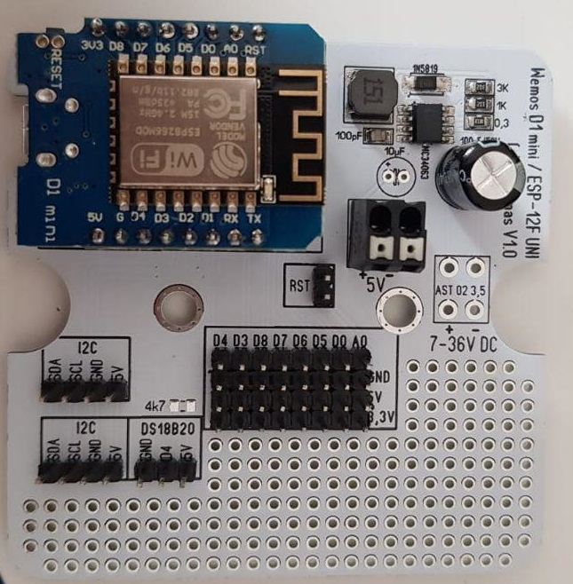
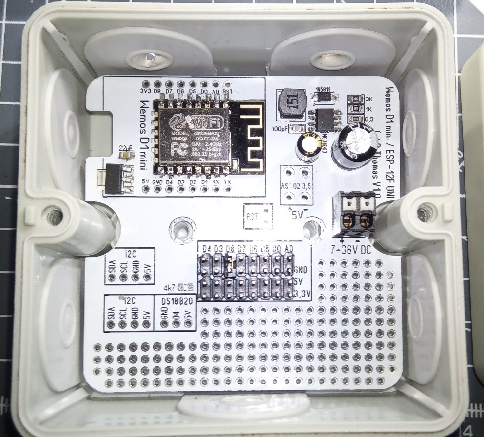
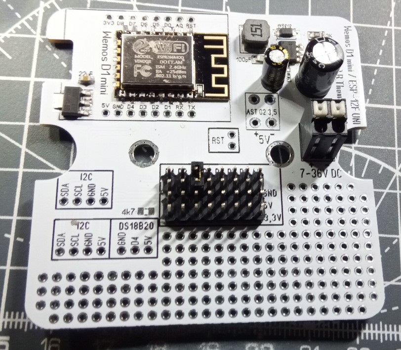
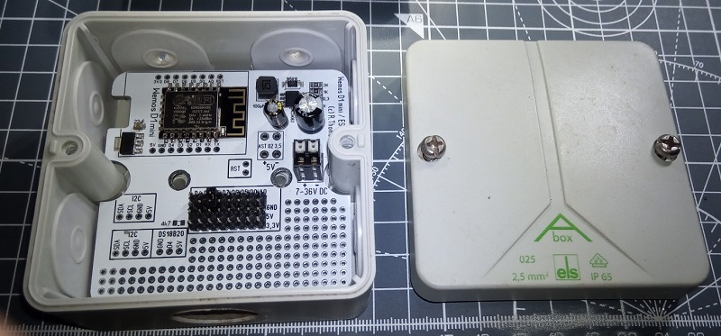
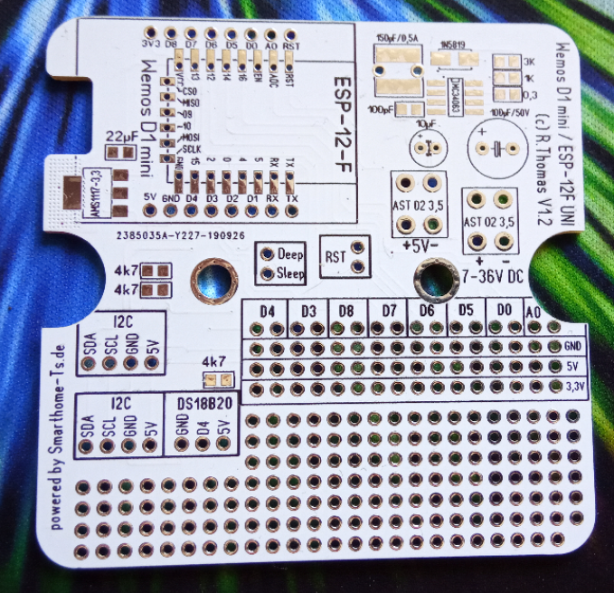
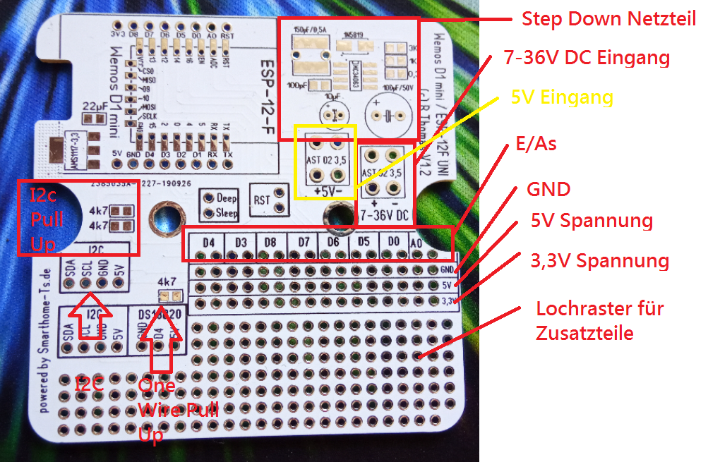

# Mqtt Wemos / ESP-12F Uni PCB
## benötigte Hardware für 7-36V Eingangsspannung
* Elektrolytkondensator 10 uF/16V RM2,54		1x
* Elektrolytkondensator 100 µF/50V RM3,5		1x
* MC34063A SOP-8					1x
* 1N5819 SMD						1x
* Stehende-Induktivität, 07HCP, Ferrit, 22µF RM5 
	oder SMD 6x6mm	1x
* Keramik kondensator 50 v 100pF 0805			1x
* 0,3Ohm 0805						1x
* 3KOhm 0805						1x
* 1KOhm 0805						1x
* Federkraftklemme 2-pol, Ø 1,5 mm, RM 3,5  (AST 02 3,5) 1x

## benötigte Hardware für 5V Eingangsspannung
* Elektrolytkondensator 10 uF/16V RM2,54		1x
* Federkraftklemme 2-pol, Ø 1,5 mm, RM 3,5  (AST 02 3,5) 1x

## bei Verwendung eine ESP-12F wird zusätzlich folgende Hardware benötigt
* Keramik kondensator 22µF 0805				1x
* AMS1117-3.3 SOT-223					1x

## Optionale Hardware
* 4,7kOhm 0805 für Pull-Up I2C				2x
* 4,7kOhm 0805 für One Wire (z.b. DS18B20)		1x

## Software
Als Software dient [ESPEasy](https://www.letscontrolit.com) damit ist es möglich die Daten per MQTT an IOBrocker zu senden.

## PinOut

Als Pinaout sehen folgende IOs auf der Platine zur Verfügung:
D4, D3, D8, D7, D6, D5, D0, A0, I2c, Onewire sowie ein Lochraster zum verschalten von zusatzkomponenten.

Die ganze Platine passt in ein Spelsberg Abox 025 Abzweigdose und ist damit auch für aussen geeignet da IP65.
Achtung ! Die E/A s dürfen nur mit 3,3V betrieben werden! 

[Kontakt via Facebook](https://www.facebook.com/ronny.thomas.83)

[Kontakt via Homematic Forum](https://homematic-forum.de/forum/memberlist.php?mode=viewprofile&u=13127)

[Kontakt via Telegramm]()

## Pinout

